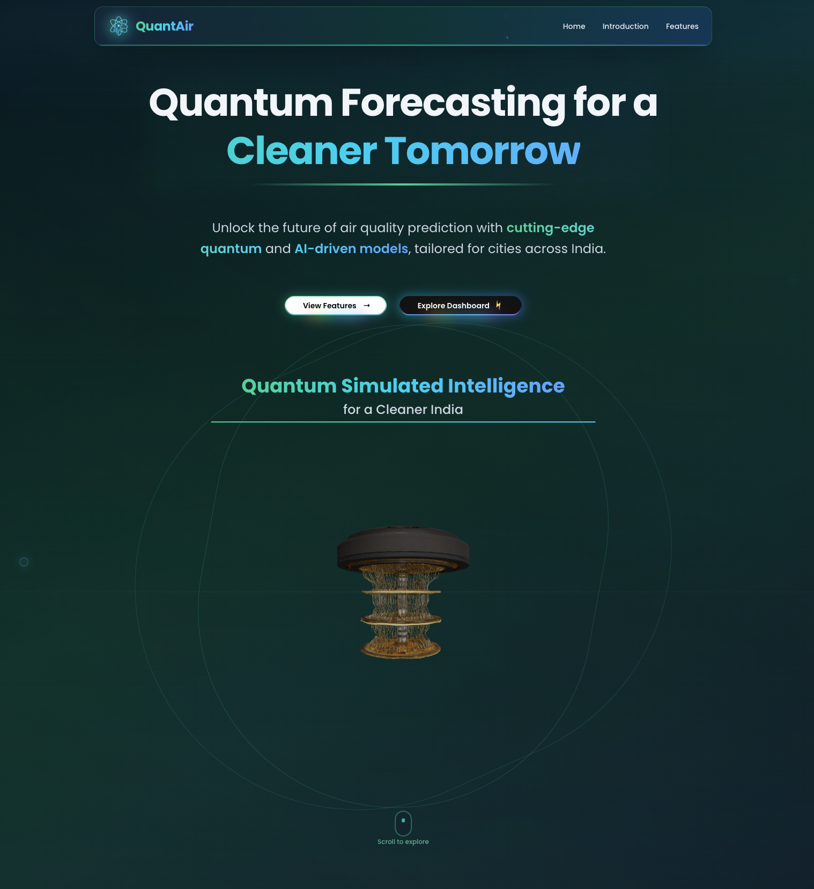
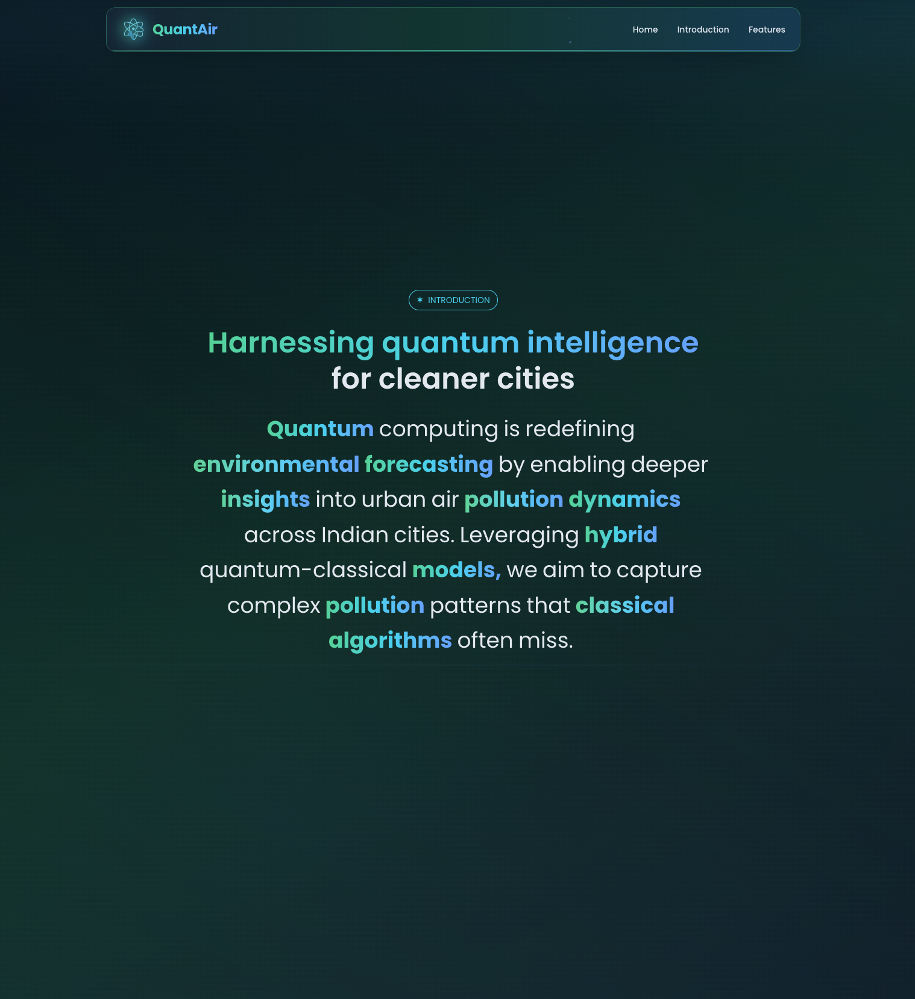
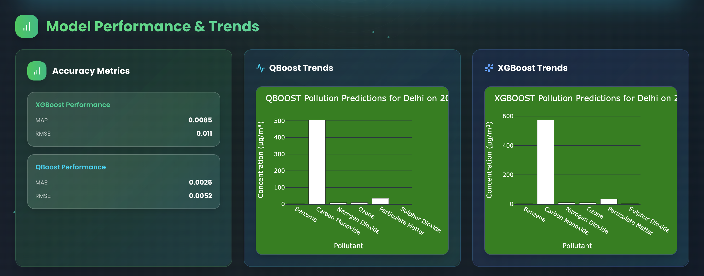
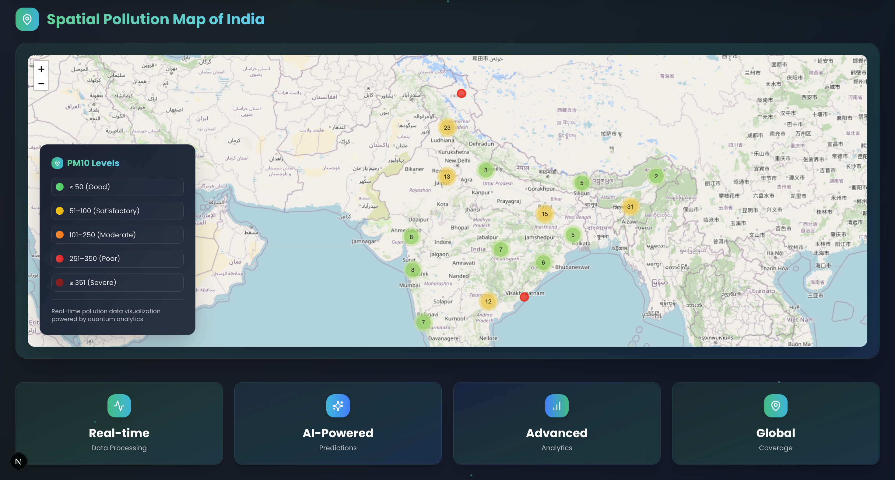
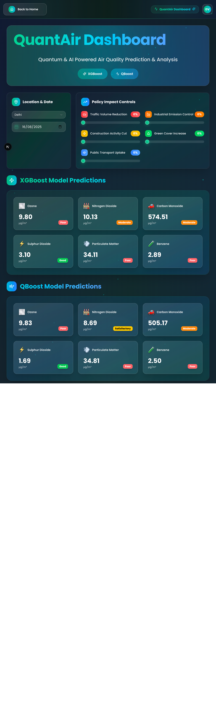
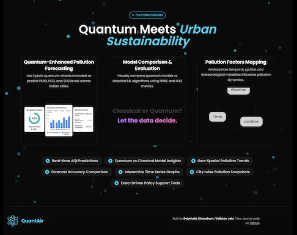

# QuantAir – Quantum-Enhanced Predictive Modeling of Urban Air Pollution Dynamics

🚀 **QuantAir** is a hybrid AI system that integrates **classical ML (XGBoost)** and **Quantum Neural Networks (QNNs)** to predict and visualize urban air pollution in Indian cities. It includes an interactive web dashboard with **policy impact simulations, geospatial maps, and real-time trend visualizations**.



## 🌍 Project Overview

Air pollution is one of the most critical challenges in Indian cities, impacting health, quality of life, and sustainability.  
**QuantAir** addresses this by providing **quantum-enhanced forecasts** of pollutants like **PM2.5, PM10, NO₂, SO₂, CO, and Benzene**, combining classical ML and quantum methods.

- **Classical Baseline:** XGBoost regression model  
- **Quantum Enhancement:** QBoost (hybrid QNN residual model via Qiskit)  
- **Visualization:** Next.js dashboard with charts, policy sliders & maps  
- **Impact Modeling:** Simulates traffic, industry, construction, green cover, and transport policies  



---

## ⚙️ System Architecture

1. **Frontend (Next.js + React)**  
   - Dropdowns for city/date selection  
   - Policy sliders (Traffic, Industry, Construction, Green Cover, Public Transport)  
   - Real-time Plotly charts + Folium map  

2. **Backend (Flask)**  
   - `/predict` → pollutant forecasts from XGBoost + QBoost  
   - `/metrics` → model evaluation (RMSE, MAE)  
   - `/graphs` → dynamic Plotly charts  

3. **Modeling Layer**  
   - **XGBoost:** classical regression baseline  
   - **QBoost (QNN):** residual correction using variational quantum circuits  
---

## 🛠️ Technologies Used

- **Frontend:** Next.js, React, TailwindCSS, Plotly.js  
- **Backend:** Flask, REST APIs  
- **ML Models:** XGBoost, Scikit-learn, Pickle, NumPy  
- **Quantum:** Qiskit (Aer simulator, QNN circuits)  
- **Visualization:** Folium (geospatial maps), Plotly (graphs)  
- **Other:** Python 3.11+, Node.js  

---

## 📊 Results

| Metric | XGBoost | QBoost (Quantum-Enhanced) |
|--------|---------|----------------------------|
| RMSE   | ~6.42 µg/m³ | ~5.81 µg/m³ |
| MAE    | ~4.95 µg/m³ | ~4.22 µg/m³ |
| Inference Time | ~0.9s | ~1.7s (due to quantum simulation) |

✅ QBoost achieved **better accuracy** than XGBoost by capturing complex nonlinear pollution patterns.  
⚠️ Slight latency trade-off due to quantum simulation.



---

## 📌 Features



- 🌆 **City & Model Selection** (toggle between XGBoost and QBoost)  
- 🎛️ **Policy Simulation** (adjust real-time pollution levels with sliders)  
- 📊 **Interactive Charts** (XGBoost vs QBoost predictions)  
- 🗺️ **Geospatial Map** (Folium heatmaps of Indian cities)  
- 📈 **Performance Metrics** (MAE, RMSE, accuracy improvement)  



---

## 🚀 Installation & Setup

### 1️⃣ Clone Repository
```bash
git clone https://github.com/your-repo/QuantAir.git
cd QuantAir
2️⃣ Frontend Setup (Next.js)
cd client
npm install
npm run dev
Runs at: http://localhost:3000

3️⃣ Backend Setup (Flask)
cd server
python -m venv venv
source venv/bin/activate   # (Linux/Mac)
venv\Scripts\activate      # (Windows)

pip install -r requirements.txt
cd model
python app.py
Runs at: http://127.0.0.1:5001

cd map
python app.py
Runs at: http://127.0.0.1:5000

👨‍💻 Authors
Vaibhav Jain (A2305223115)

Debshata Choudhury (A2305223104)

Guided by: Dr. Subhash Chand Gupta, Amity University Uttar Pradesh

📜 License
This project is for academic and research purposes only.
For any reuse, please cite the authors and Amity University.